  
  
  
  
  

---

### The notebook

Everything I learn about quantum computing, written down in order, at [tuguidragos.com](https://tuguidragos.com). Five notes, picked fresh every day:

<!-- NOTES:START -->
- [The Python you actually need for quantum computing](https://tuguidragos.com/the-python-you-actually-need-for-quantum-computing/)
- [Running Quantum Circuits on Real IBM Hardware from n8n](https://tuguidragos.com/quantum-circuits-ibm-hardware-n8n/)
- [The version trap that cost me an evening (Qiskit 2.x)](https://tuguidragos.com/the-version-trap-that-cost-me-an-evening-qiskit-2-x/)
- [Quantum gates are just matrices you can run by hand](https://tuguidragos.com/quantum-gates-are-just-matrices-you-can-run-by-hand/)
- [I Just Earned My First IBM Quantum Badge and I Am Not Going Back](https://tuguidragos.com/i-earned-my-first-ibm-quantum-badge/)
<!-- NOTES:END -->

 

### Stack

<table>
  <tr>
    <td align="left"><strong>quantum</strong></td>
    <td align="left">    </td>
  </tr>
  <tr>
    <td align="left"><strong>automation</strong></td>
    <td align="left">  </td>
  </tr>
  <tr>
    <td align="left"><strong>always on</strong></td>
    <td align="left"></td>
  </tr>
</table>
